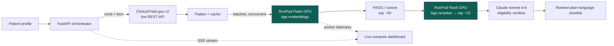

# Lifeline — live clinical-trial matching on RunPod Flash

> A family facing a hard diagnosis tonight can understand which trials they
> might qualify for **in under 90 seconds** — instead of waiting weeks.

ClinicalTrials.gov already exists, but it is **search, not matching**. Searching
"breast cancer" returns thousands of trials, each wrapped in dense, doctor-facing
inclusion/exclusion criteria. No scared family can read all of it and figure out
which few fit *their* specific situation — so eligible patients never find trials,
and trials fail from under-enrollment.

**Lifeline** takes a patient profile, pulls **live** currently-recruiting trials
from ClinicalTrials.gov, runs **GPU-accelerated semantic search + reranking on
RunPod Flash**, then uses **Claude** to reason over each trial's eligibility
criteria — and returns a short, ranked, plain-language shortlist the patient can
bring to their doctor tonight.

> ⚕️ **Lifeline is an information tool, not medical advice.** It never diagnoses
> or recommends treatment — it surfaces options to confirm with a licensed clinician.

---

## What makes it work

1. **The patient output** — instead of an overwhelming list, a handful of real
   options with a plain-English eligibility verdict, *why you might qualify*,
   *why you might not*, the nearest site, and a direct link + contact.
2. **The live RunPod compute dashboard** — GPUs visibly scale up for the
   embedding burst and back to zero, with an honest cost-efficiency story.

## Architecture



**GPU only where it pays.** Ingest (CPU + API) and Claude reasoning (CPU) run on
cheap hardware; only the heavy embed/rerank stages burst onto GPU workers.

### Tiered fallback (one codebase, two modes)

Every external dependency degrades gracefully, selected at runtime by key presence
+ `DEMO_MODE`. The orchestrator never branches on tier — only `compute_metrics.mode`
reflects which ran.

| Capability | Tier 1 (keys present) | Tier 2 | Tier 3 (guaranteed) |
|---|---|---|---|
| Ingest | Live ClinicalTrials.gov v2 | — | Cached `trials_<cond>.json` |
| Embed  | **Flash GPU** bge-base | local CPU sentence-transformers | TF-IDF (scikit-learn) |
| Rerank | **Flash GPU** bge-reranker | local CPU CrossEncoder | retrieval order |
| Reason | **Claude** sonnet-4-6 | — | local rule-based engine |
| Dashboard | real worker telemetry | — | labeled representative burst |

> **Honesty:** trial counts and wall-clock are always **real**; GPU-seconds and
> cost are clearly labeled **estimates**. In demo mode the worker burst is a
> labeled *representative* profile — we never fake live worker telemetry.

---

## Setup

### 1. Backend (Python 3.12+)

```bash
cd "Lifeline"
python3 -m venv .venv && source .venv/bin/activate
pip install -r backend/requirements.txt        # light: no torch needed for demo
cp .env.example .env                            # DEMO_MODE=true works with no keys

python scripts/build_cache.py                   # fetch live seed-condition trials
uvicorn backend.main:app --port 8000
```

> ClinicalTrials.gov's CDN blocks plain Python HTTP clients at the TLS-fingerprint
> level, so ingestion uses `curl_cffi` (impersonates Chrome). This is already wired in.

### 2. Frontend (Node 18+)

```bash
cd frontend
npm install
npm run dev          # http://localhost:3000
```

Open **http://localhost:3000**, click a seed profile, and watch it run.

### 3. Light up the live paths (optional)

```bash
pip install runpod-flash anthropic               # + sentence-transformers torch faiss-cpu
# set RUNPOD_API_KEY, ANTHROPIC_API_KEY, DEMO_MODE=false in .env
flash login
flash dev --auto-provision                       # pre-warm endpoints (avoid cold start)
# for a persistent deployment:
flash deploy
```

The `@Endpoint`-decorated functions in `backend/flash_embed.py` and
`backend/flash_rerank.py` are discovered by Flash. Pre-warming before a demo
keeps the on-stage burst snappy.

---

## Demo script (~90 seconds)

1. **Open** `http://localhost:3000`. Read the one-line pitch and the pinned
   disclaimer aloud: *"information tool, not medical advice."*
2. **Click** the **"Metastatic HER2+ breast cancer"** seed profile. Point out it
   fills a real patient: 54, female, San Jose, prior chemo, HER2+.
3. **Click "Find my trials."** You land on the **dark compute dashboard**.
   - Point at the **pipeline bar**: "GPU only for the heavy embed/rerank — cheap
     CPU for ingest and Claude reasoning."
   - Point at the **GPU worker grid + timeline**: "Workers burst up to absorb the
     embedding load… then **scale to zero** — we pay nothing while idle."
   - Point at the **efficiency panel**: "An always-on GPU is ~\$17/day and idle
     ~98% of the time. This run cost a fraction of a cent — **≈Nx cheaper**."
   - The dashboard **stays put** — dwell as long as you like. (Revisit anytime via
     `View compute dashboard ↗` on the results page, or open `/processing?view=last`.)
4. **Click "See your N matched trials →."** Land on the calm results page:
   *"We searched **2,481 active trials** and found these 15 to ask your doctor about."*
   - Show a green **Likely eligible** card: the plain-language summary, *why you
     might qualify*, the nearest site, and the direct ClinicalTrials.gov link.
5. **Close:** *"That family just went from thousands of unreadable trials to a
   handful they can bring to their doctor tonight — powered by a GPU burst that
   cost less than a penny and scaled to zero."*

---

## Project layout

```
Lifeline/
├── backend/
│   ├── main.py            FastAPI + SSE progress stream
│   ├── pipeline.py        ingest → embed → retrieve → rerank → reason
│   ├── ingest.py          ClinicalTrials.gov v2 (curl_cffi) + cache
│   ├── flash_embed.py     @Endpoint bge embeddings + tier fallback   ← Flash
│   ├── flash_rerank.py    @Endpoint bge reranker  + tier fallback    ← Flash
│   ├── eligibility.py     Claude verdicts + local rule engine (strict JSON)
│   ├── embedding_index.py FAISS / cosine + TF-IDF fallback
│   ├── metrics.py         honest compute accounting (GPU-sec/cost est.)
│   ├── models.py          shared pydantic contract
│   └── cache/             shipped seed-condition corpora
├── scripts/build_cache.py
├── frontend/              Next.js (App Router) + Tailwind
│   └── app/{page,processing,results}
├── .env.example
└── README.md
```

## Notes

- Default models: `bge-base-en-v1.5` + `bge-reranker-base` (speed); switch to
  `-large` via `EMBED_MODEL` for quality.
- Eligibility verdict policy lives in `backend/eligibility.py::score_verdict` —
  the single, well-documented place to tune how conservative Lifeline is.
- Resilience: ClinicalTrials.gov, Flash, and Claude calls are each wrapped with
  timeouts and tiered fallbacks, so the demo never hard-crashes.
