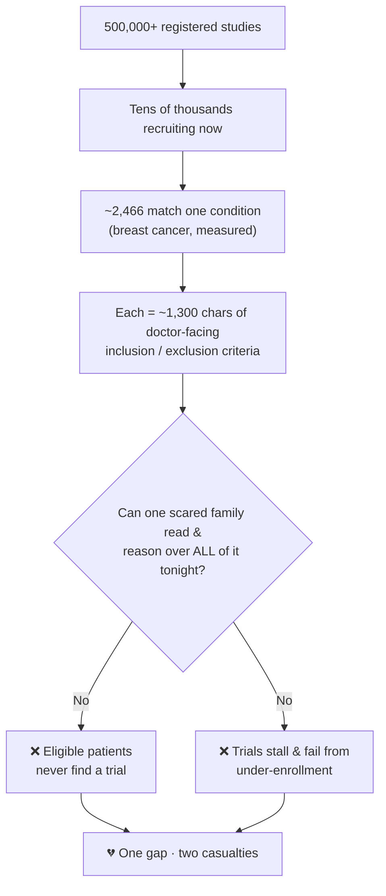
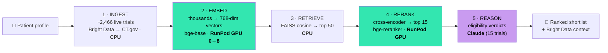
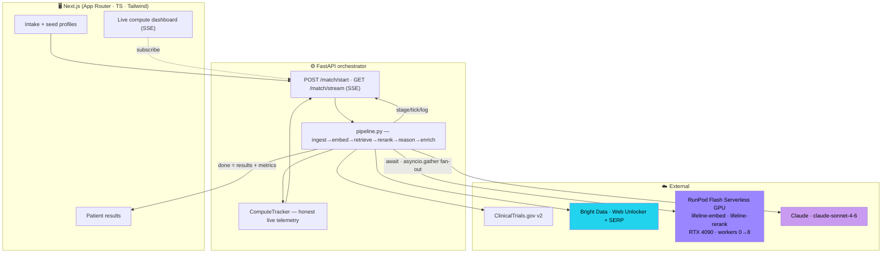
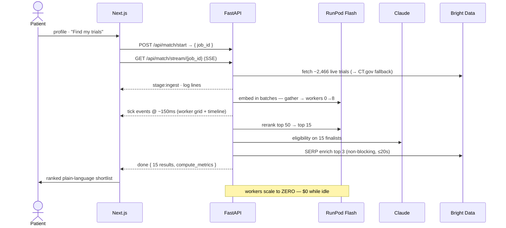
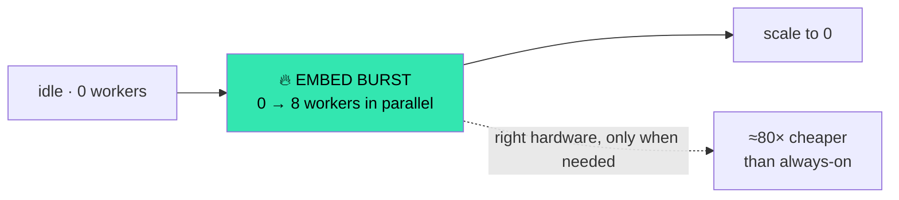
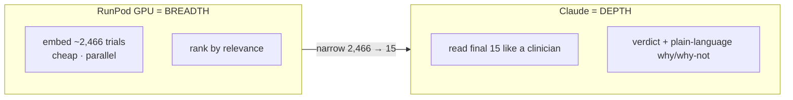
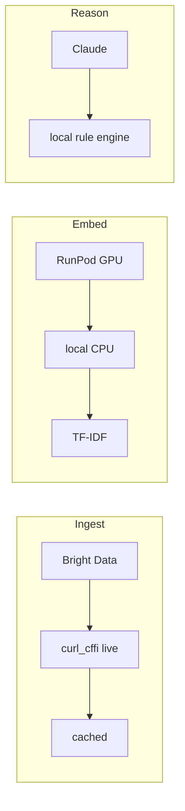

<div align="center">

# 🫀 Lifeline

### Live, GPU-accelerated clinical-trial *matching* — for the families who can't wait.

**A family facing a hard diagnosis tonight can understand which trials they might qualify for in under 90 seconds — instead of waiting weeks.**

`RunPod Flash` · `Claude claude-sonnet-4-6` · `Bright Data` · `ClinicalTrials.gov v2` · `FastAPI` · `Next.js`

**500,000+ studies** · **2,466 recruiting for one condition** · **~$0.01 / patient query** · **≈80× cheaper than always-on GPU** · **<90s vs. weeks**

</div>

---

## ⚡ The pitch

**ClinicalTrials.gov already exists — but it's *search*, not *matching*.** Search "breast cancer" → **2,466 recruiting trials** (measured live), each wrapped in dense, doctor-facing inclusion/exclusion criteria averaging **~1,300 characters**. No scared family can read all of it and decide which few fit *their* situation. So **eligible patients never find trials — and trials fail from under-enrollment.** One gap, two casualties.

**Lifeline closes it.** Given a patient profile, it:

1. 🌐 **pulls live recruiting trials** from ClinicalTrials.gov (resilient ingestion via Bright Data),
2. ⚡ runs **GPU-accelerated semantic search + reranking on RunPod Flash** — shrinking **thousands → the 15 most relevant** in *seconds*, scaling GPU workers **0 → 8 → 0** on demand,
3. 🧠 uses **Claude** to reason over each finalist's eligibility criteria like a clinician, and
4. 🎯 returns a short, ranked, **plain-language shortlist** to bring to a doctor **tonight** (each match optionally enriched with web context via Bright Data).

> The bottleneck was never the data — it's that **no human can read it all fast enough for one specific person.** **RunPod Flash is what makes the reading possible:** GPU-scale embedding + reranking over thousands of trials per patient, on demand, then scaled back to zero so it costs almost nothing.

---

## 📊 By the numbers

<table>
<tr><th>💔 The problem (industry)</th><th>⚙️ The system (design)</th><th>✅ A live run (measured)</th></tr>
<tr><td valign="top">

| | |
|--|--|
| Registered studies | **500,000+** |
| Recruiting, one condition | **2,466** |
| Trials delayed by recruitment | **~80%** |
| Terminated for low accrual | **~1 in 5** |
| Cancer patients who enroll | **< 5%** |
| Would join *if they knew* | **~75%** |

</td><td valign="top">

| | |
|--|--|
| Corpus per query | **up to 1,200** trials |
| Embedding | **bge-base**, 768-dim |
| Reranker | **bge-reranker** cross-enc. |
| GPU | **RTX 4090**, workers **0→8** |
| Batch size | **48** trials/call |
| Funnel | **N → 50 → 15** |

</td><td valign="top">

| | |
|--|--|
| Trials ranked | **2,466** |
| Vectors computed | **768-dim** |
| Reasoning (Claude) | **top 15** |
| Cost / query | **~$0.01** (est) |
| vs always-on GPU | **≈80× cheaper** |
| Time | **<90s** vs weeks |

</td></tr>
</table>

<sub>Left column = widely-cited industry statistics, included for context (not outputs of Lifeline). Middle = system configuration. Right = measured from a live RunPod Flash run, with GPU-seconds/cost clearly labeled as estimates.</sub>

---

## 💔 The problem

Recruitment is the **#1 reason trials are delayed or fail** — roughly **80%** miss enrollment timelines and about **1 in 5** terminate for insufficient accrual. Meanwhile **fewer than 5%** of adult cancer patients ever enroll, even though **~75%** say they would if they knew an option existed. A single day of trial delay is widely estimated to cost sponsors **$0.6M–$8M** in lost value.

The cause isn't missing data — it's **unreadable** data at the moment of need:



---

## ✅ What Lifeline does — the matching funnel

The core engineering insight is a **funnel that puts the right compute at each stage** — cheap CPU where it suffices, GPU only for the embarrassingly-parallel heavy lift, the LLM only for the final, nuanced reasoning:



| Stage | Hardware | Work | Why here |
|---|---|---|---|
| Ingest | CPU / network | fetch ~2,466 trials, paginate 1,000/page | I/O-bound, no GPU needed |
| **Embed** | **RunPod GPU** | thousands × 768-dim, batches of 48, fanned out 0→8 | embarrassingly parallel, bursty |
| Retrieve | CPU (FAISS) | cosine top-50 over the corpus | sub-millisecond at this scale |
| **Rerank** | **RunPod GPU** | cross-encoder scores 50 query–trial pairs | precision step, GPU-bound |
| **Reason** | **Claude** | structured eligibility on 15 finalists | nuance, not search |

**Each result card delivers:** a color-coded verdict (✅ likely / 🟡 possibly / ⚪ unlikely) + confidence, *why you might qualify*, *why you might not*, nearest site, official link + contact, and **recent web context via Bright Data** — all framed as **"bring this to your doctor."**

---

## 🏗️ Architecture



### Request lifecycle



---

## 📈 Performance & cost model

**Latency.** Warm, a full query (ingest → shortlist) runs in **single-digit seconds**. The first call after idle pays a **one-time ~25–50s cold start** (each fresh worker downloads the ~440 MB model); `verify_flash.py` pre-warms it. *Honest note: GPU-seconds and cost are estimates derived from real wall-clock — cold starts inflate both, and we label them as such.*

**Cost (this workload).**

| | Always-on GPU (traditional) | **RunPod Flash (this run)** |
|---|---|---|
| RTX 4090 rate | ~$0.69/hr → **~$17/day**, billed 24/7 | **~$0.01 / query** |
| Utilization | idle **~98%** | **~98% used** during the burst |
| Idle cost | wasted around the clock | **$0 — scaled to zero** |
| **Net** | | **≈ 80× cheaper for this workload** |

**Throughput.** Embedding fans out at **48 trials/call across up to 8 workers** — the full ~2,466-trial corpus is vectorized in a few warm seconds, then the fleet returns to zero.

---

## 🚀 RunPod Flash — the four judge questions, answered



| Question | Answer |
|---|---|
| **How are we using it?** | Self-hosted `bge-base` + `bge-reranker` on Flash Serverless GPU endpoints (`@Endpoint`, RTX 4090). `asyncio.gather` fan-out triggers real parallel worker scale-up. |
| **How does it scale up/down?** | `workers=(0,8)` — cold zero → spikes during the embed burst → **back to zero** when idle. Live worker grid + timeline prove it. |
| **How efficiently?** | GPU **only** for embed/rerank; CPU for ingest/retrieve; Claude API for reasoning. **~$0.01/query**, ~98% utilization while active. |
| **How does it help?** | It's the only thing that can read & rank **thousands of trials per patient** fast enough to matter — at near-zero idle cost. |

---

## 🧠 Why GPUs *and* an LLM — the token math

*"Couldn't Claude just do all of it?"* No — and the numbers show why:



| Approach | Tokens / query | Fits 200K context? | Verdict |
|---|---|---|---|
| **Naive — dump all trials into the LLM** | 2,466 × ~1,300 chars ≈ **~1M tokens** | ❌ no (≈5× over) | infeasible + slow + costly |
| **Lifeline — embed on GPU, LLM on top 15** | 15 × ~1.5K tokens ≈ **~25K tokens** | ✅ yes | **~40× fewer tokens**, feasible |

**Claude can't embed** (it's a generator, not an encoder), and reading thousands of trials per query is ~1M tokens — over the context window and expensive. So you *must* narrow first with **encoder models on GPUs (RunPod)**, then spend the LLM only on the **15 finalists (~25K tokens)**. Right hardware, right stage.

---

## 🛡️ Engineering decisions worth noting

- **TLS-fingerprint bypass.** ClinicalTrials.gov's CDN 403s `requests`/`httpx` at the JA3 level (verified). We fetch with **`curl_cffi` (Chrome impersonation)** and, in production, route through **Bright Data Web Unlocker** — so the live data path doesn't silently break on stage.
- **Warm-model pattern on Flash.** Heavy imports live *inside* the `@Endpoint` body (Flash requirement); the model is cached in a **module-global, lazily initialized on first call**, so warm workers skip reload.
- **Honest telemetry by construction.** `ComputeTracker` counts **unique trials** separately from **total GPU work-items** (so the dashboard never reads "processed > available"), and labels GPU-seconds/cost as estimates. Simulated bursts are explicitly tagged.
- **One interface, tiered fallback.** Each dependency degrades silently so a missing key or a cold endpoint never hard-fails the demo (table below).



| Stage | Tier 1 | Tier 2 | Tier 3 (guaranteed) |
|---|---|---|---|
| Ingest | Bright Data → CT.gov | live CT.gov (`curl_cffi`) | cached snapshot |
| Embed | RunPod Flash GPU | local CPU | TF-IDF |
| Rerank | RunPod Flash GPU | local CPU | retrieval order |
| Reason | Claude | — | local rule engine (same JSON) |
| Dashboard | real worker telemetry | — | labeled representative burst |

---

## 🧬 Tech stack

| Layer | Tech |
|---|---|
| GPU compute | RunPod Flash (`runpod-flash`, `@Endpoint`) · `bge-base-en-v1.5` (768-dim) + `bge-reranker-base` via `sentence-transformers` |
| Reasoning | Anthropic Claude `claude-sonnet-4-6` |
| Web extraction | Bright Data Web Unlocker + SERP API |
| Data | ClinicalTrials.gov v2 REST (`curl_cffi`, TLS-safe) |
| Backend | Python 3.12 · FastAPI · SSE (`sse-starlette`) · FAISS / NumPy · async |
| Frontend | Next.js (App Router) · React · TypeScript · Tailwind |

---

## ▶️ Setup & run

```bash
# Backend
cd Lifeline && python -m venv .venv && source .venv/bin/activate
pip install -r backend/requirements.txt
cp .env.example .env             # all keys optional — runs in DEMO_MODE without them
python scripts/build_cache.py    # snapshot seed conditions for offline fallback
uvicorn backend.main:app --port 8000

# Frontend (second terminal)
cd frontend && npm install && PORT=3000 npm run dev   # → http://localhost:3000
```

**Go live on RunPod Flash:** [`DEPLOY.md`](DEPLOY.md) — `flash deploy`, pre-warm, then `python scripts/verify_flash.py` (the pass/fail gate that asserts `flash_live`).

```
# .env
RUNPOD_API_KEY=        # live GPU burst (else simulated, labeled)
ANTHROPIC_API_KEY=     # live Claude reasoning (else local rule engine)
BRIGHTDATA_API_KEY=    # + BRIGHTDATA_ZONE / BRIGHTDATA_SERP_ZONE (from your dashboard)
DEMO_MODE=false        # true = cached + guaranteed tiers, on-stage safe
GPU_COST_PER_SECOND=0.00012
```

---

## ⚕️ Not medical advice

Lifeline is an **information tool, not medical advice.** It never diagnoses or recommends treatment — it surfaces options to **confirm and decide with a licensed clinician.** A non-dismissible disclaimer is pinned across the app.

<div align="center">

**From "thousands of trials, no idea where to start" → "here are the few to ask your doctor about — tonight."**

</div>
